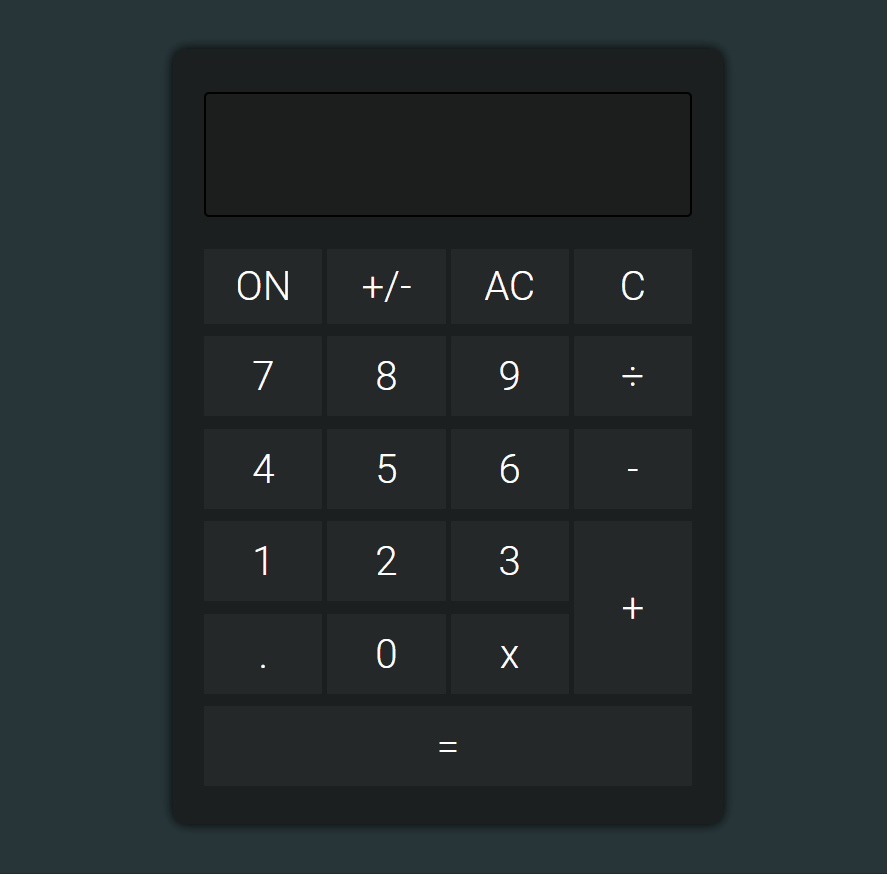
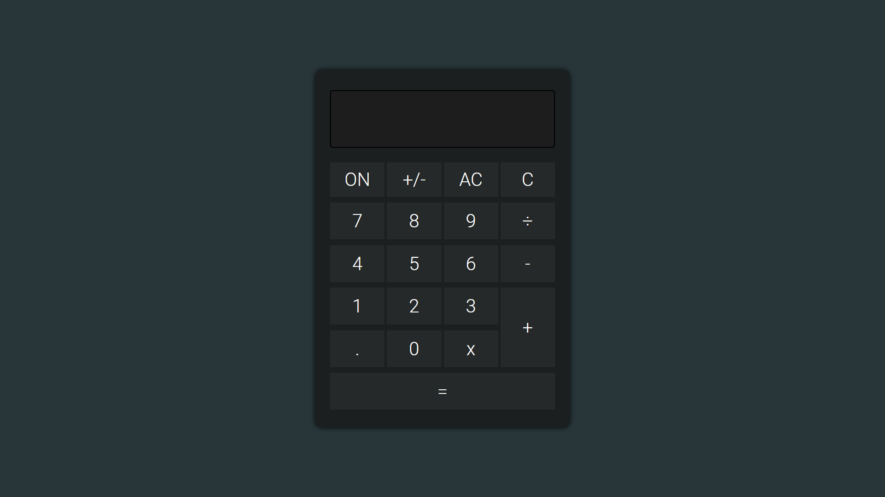
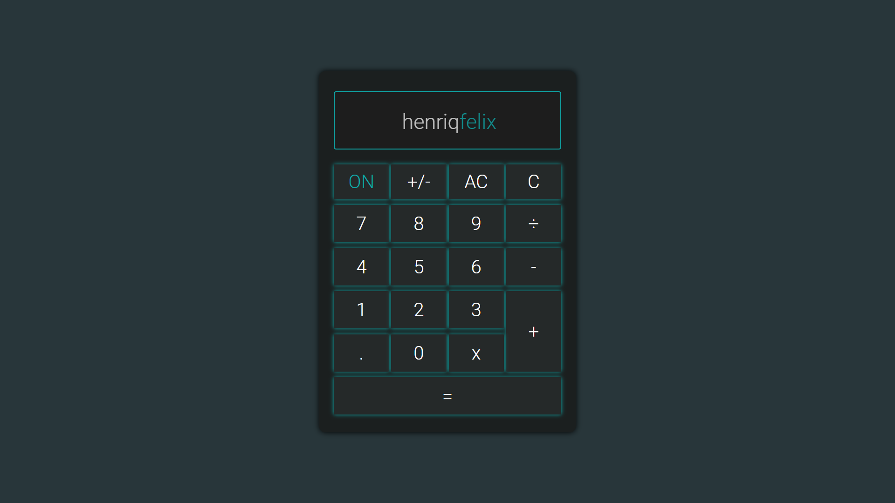
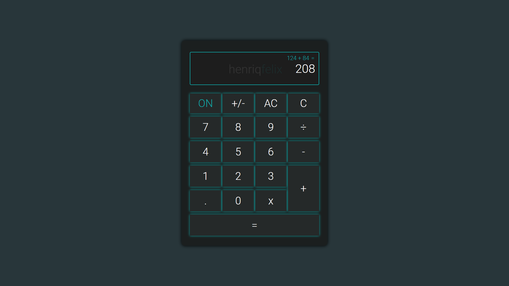

# Calculator

### Preview

### Calculator Off

### Calculator On

### Calculator Running

---

Calculators are not only one of the most useful tools available, but they are
also a great way to understand UI and event processing in an application. In
this problem you will create a calculator that supports basic arithmetic
calculations on integers.

The styling is up to you so use your imagination and get creative! You might
also find it worth your time to experiment with the calculator app on your
mobile device to better understand basic functionality and edge cases.

---

> ### 🚫 Constraints

- I may not use the `eval()` function to execute calculations.

---

> ### ✔️ User Stories

- [x] User can see a display showing the current number entered or the result of the last operation;
- [x] User can see an entry pad containing buttons for the digits 0-9;
operations 'x' '+', '-', '/', and '=', a 'C' button (for clear), and an 'AC' button (for clear all);
- [x] User can enter numbers as sequences up to 8 digits long by clicking on digits in the entry pad. Entry of any digits more than 8 will be ignored;
- [x] User can click on an operation button to display the result of that operation on:
  - the result of the preceding operation and the last number entered OR
  - the last two numbers entered OR
  - the last number entered;
- [x] User can click the 'C' button to clear the last number or the last
operation. If the users last entry was an operation the display will be updated to the value that preceded it;
- [x] User can click the 'AC' button to clear all internal work areas and to set the display to 0;
- [x] User can see 'ERR' displayed if any operation would exceed the 8 digit maximum.

---

> ### ➕ Bonus features

- [x] User can click a '+/-' button to change the sign of the number that is currently displayed;
- [x] User can use the calculator just when the button ON is activated.

> ### 💻 Technologies Used

- HTML
- CSS
- Javascript

> ### ⚠️ Observation

The application is not 100% finished, but it's already possible to use it.